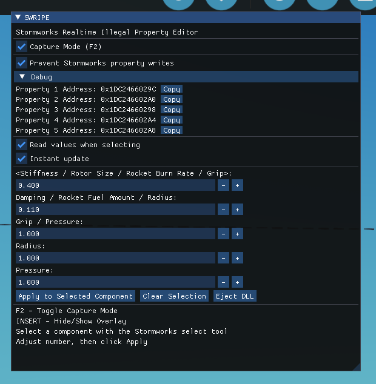

# SWRIPE

Stormworks Realtime Illegal Property Editor

A thing I made because I got tired of editing XML (and because why not).

## READ THIS FIRST

SWRIPE uses DLL injection, hardware breakpoints, vectored exception handlers and direct memory modification.

The tool works by hooking into the running game and reading or writing component properties directly from memory.

Because of how it works:

- Crashes are possible
- Game updates may break functionality
- Antivirus software may(will) complain
- Injecting or ejecting the DLL are the most likely times for something to go wrong

So don't forget to save often

SWRIPE does not modify any Stormworks files on disk.
Closing Stormworks removes all changes made by SWRIPE.
You must run the injector again after restarting the game.

Only supports the 64 bit Windows version of Stormworks (stormworks64.exe).
If the instruction offset changes in a game update, i will have to update it.

It will only detect properties that is a slider, and is already accesible ingame, not hidden values.

## Basic Info

SWRIPE lets you change component properties beyond the limits normally allowed by Stormworks without editing vehicle XML files.

Enable Capture Mode, select a component with the normal Stormworks select tool and SWRIPE will attempt to capture the properties being accessed by Stormworks.

Once captured, the values can be viewed and modified directly from the overlay.

Changes can be applied instantly or manually.

Selecting another component will automatically start a new capture.

If you need to inspect or continue editing an already modified component, enable Prevent Stormworks Property Writes to stop Stormworks from clamping values back to legal ranges while the component is selected.

## How To Use

1. Start Stormworks.
2. Run the injector.
3. A window called SWRIPE should appear, its visibility can be toggled with INSERT.
4. Enable Capture Mode (F2).
5. Select a component using the normal Stormworks select tool.
6. SWRIPE will attempt to capture the property addresses and read their current values.
7. Edit values using:
   - The number input boxes
   - The +/- buttons
   - Left/Right arrow keys to change the selected value
   - Up/Down arrow keys to select a property
8. Enable Instant Update to apply changes immediately or click Apply to Selected Component.

Once a component has been captured, you can deselect it and continue editing the captured values.

If you want to inspect or edit a component while it is still selected, enable Prevent Stormworks Property Writes first. Otherwise Stormworks will overwrite and clamp values while the component remains selected.

If things start behaving strangely, try spamming Clear Selection and selecting the component again lol

## Property Order

The displays properties will almost always from what i know, be in the same order Stormworks exposes them when a component is selected.

So the labels shown are examples based on common components and are intended as a guide rather than an exact description of every component.

Some common mappings are:

| Property | Examples |
|-----------|-----------|
| Property 1 | Stiffness, Rotor Size, Rocket Burn Rate, Grip |
| Property 2 | Damping, Rocket Fuel Amount, Radius |
| Property 3 | Grip, Pressure |
| Property 4 | Radius |
| Property 5 | Pressure |

For example:

### Normal Wheel

| SWRIPE Property | Stormworks Property |
|----------------|---------------------|
| Property 1 | Grip |
| Property 2 | Radius |
| Property 3 | Pressure |

### Suspension Wheel

| SWRIPE Property | Stormworks Property |
|----------------|---------------------|
| Property 1 | Stiffness |
| Property 2 | Damping |
| Property 3 | Grip |
| Property 4 | Radius |
| Property 5 | Pressure |

### Solid Rocket Booster

| SWRIPE Property | Stormworks Property |
|----------------|---------------------|
| Property 1 | Burn Rate |
| Property 2 | Fuel Amount |

## Prevent Stormworks Property Writes

This option prevents Stormworks from writing property values back to the selected component.

Stormworks constantly updates component properties while the component is selected. This will cause illegal values to be overwritten and clamped back into the normal editor limits.

When Prevent Stormworks Property Writes is enabled:

- Illegal values remain unchanged
- Existing illegal values can be inspected
- Existing illegal values can be edited while the component is selected
- Stormworks property sliders stop working while the option is enabled

In most cases you only need this when reading or editing a component that is currently selected.

If the component is no longer selected it usually isn't necessary.

## Technical Details

It watches a Stormworks property write instruction and captures the memory addresses being used by the game when a component property is selected.

The captured addresses are then used to read and write values directly from memory.

Property order in SWRIPE matches the order Stormworks exposes those properties when a component is selected.

Because of how the capture system works, SWRIPE currently only works with float based properties.

## Antivirus Warnings

SWRIPE uses techniques commonly used by debuggers, trainers and malware.

The injector uses APIs such as:

- OpenProcess
- VirtualAllocEx
- WriteProcessMemory
- CreateRemoteThread

The DLL uses:

- Hardware breakpoints
- Vectored exception handlers
- Direct memory reads and writes

Because of this some antivirus products may flag SWRIPE as suspicious.

You may need to add the SWRIPE folder as an exception to your antivirus.

Official releases are built from the source code available in this repository.

So if you have concerns, you can build from that.

## Disclaimer

Not affiliated with Stormworks or Geometa.
